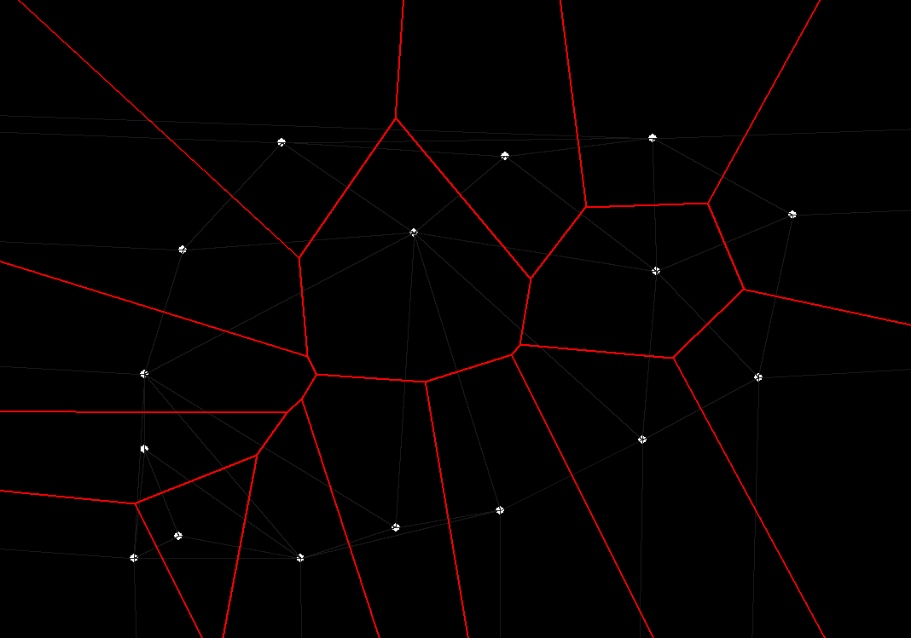

# voronoi_diagram
In mathematics, a [Voronoi diagram](https://en.wikipedia.org/wiki/Voronoi_diagram) is a partition of a plane into regions close to each of a given set of objects. In the simplest case, these objects are just finitely many points in the plane (called seeds, sites, or generators). For each seed there is a corresponding region consisting of all points of the plane closer to that seed than to any other. These regions are called Voronoi cells. The Voronoi diagram of a set of points is dual to its Delaunay triangulation. Delaunay triangulation was constructed using the [Bower-Watson algorithm](https://en.wikipedia.org/wiki/Bowyer%E2%80%93Watson_algorithm)

## How to use
```
git clone https://github.com/Taintedy/voronoi_diagram.git
cd voronoi_diagram
python3 main.py -r "Run"
```
- Use the left mouse button to add points.
- Use the space key to reset.
